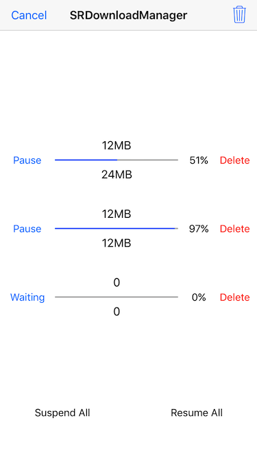
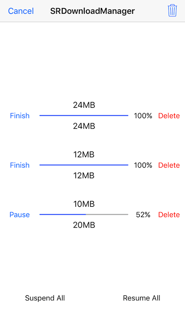

# SRDownloadManager

SRDownloadManager is a file download manager based on NSURLSession. Provide download status callback, download progress callback and download completion callback.

## Features

* [x] Support multitasking download at the same time and breakpoint download even exit the App.
* [x] Support to customize the directory where the downloaded files are saved.
* [x] Support to set maximum concurrent downloads and waiting for download queue mode.
* [x] Support to delete the specified file by URL and clear all files that have been downloaded.

## Screenshots

 

## Installation

**CocoaPods**
> Add **pod 'SRDownloadManager'** to the Podfile, then run **pod install** in the terminal.

**Manual**
> Drag the **SRDownloadManager** folder to the project.

## Usage

````objc
/**
 Starts a file download action with URL, download state, download progress and download completion block.

 @param URL        The URL of the file which to be downloaded.
 @param state      A block object to be executed when the download state changed.
 @param progress   A block object to be executed when the download progress changed.
 @param completion A block object to be executed when the download completion.
 */
- (void)downloadFileWithURL:(NSURL *)URL
                      state:(void (^)(SRDownloadState state))state
                   progress:(void (^)(NSInteger receivedSize, NSInteger expectedSize, CGFloat progress))progress
                 completion:(void (^)(BOOL success, NSString *filePath, NSError *error))completion;
````

````objc
[[SRDownloadManager sharedManager] downloadFileWithURL:URL state:^(SRDownloadState state) {
    // Called when the download state changed.
} progress:^(NSInteger receivedSize, NSInteger expectedSize, CGFloat progress) {
    // Called when the download progress changed.
} completion:^(BOOL success, NSString *filePath, NSError *error) {
    // Called when the download completion.
}];
````

## More

For more contens please see the demo.  
Submit an issue or email me if you have any questions.