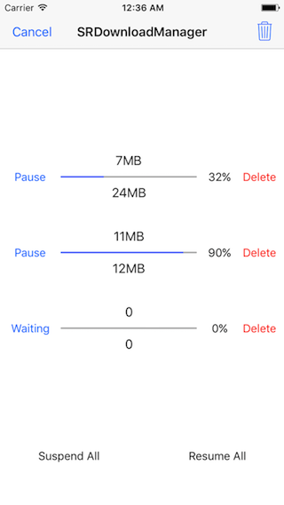
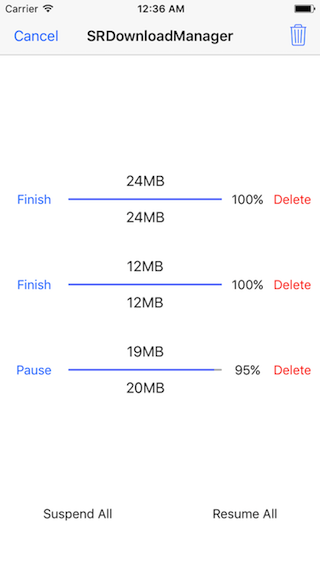

# SRDownloadManager

File download manager based on NSURLSession, support breakpoint download, multitasking download etc.

## Features

* [x] Provide download status, progress, completion callback.
* [x] Support multitasking download at the same time, breakpoint download even exit the App.
* [x] Support to set maximum concurrent downloads and waiting for download queue mode.
* [x] Support to customize the directory where the downloaded files are saved.
* [x] Support to delete the specified file by URL and clear all files that have been downloaded.

## Screenshots

 

## Installation

### CocoaPods
> Add **pod 'SRDownloadManager'** to the Podfile, then run **pod install** in the terminal.

### Manual
> Drag the **SRDownloadManager** folder to the project.

## APIs

````objc
+ (instancetype)sharedManager;

/**
 Download a file with download state, progress, completion callback block.

 @param URL        The URL of the file which want to download.
 @param state      The callback block when the download state changed.
 @param progress   The callback block when the download progress changed.
 @param completion The callback block when the download completion.
 */
- (void)downloadFileOfURL:(NSURL *)URL
                    state:(void (^)(SRDownloadState state))state
                 progress:(void (^)(NSInteger receivedSize, NSInteger expectedSize, CGFloat progress))progress
               completion:(void (^)(BOOL success, NSString *filePath, NSError *error))completion;

- (BOOL)isDownloadCompletedOfURL:(NSURL *)URL;
````

````objc
#pragma mark - Downloads

- (void)suspendDownloadOfURL:(NSURL *)URL;
- (void)suspendAllDownloads;

- (void)resumeDownloadOfURL:(NSURL *)URL;
- (void)resumeAllDownloads;

- (void)cancelDownloadOfURL:(NSURL *)URL;
- (void)cancelAllDownloads;
````

````objc
#pragma mark - Files

- (NSString *)fileFullPathOfURL:(NSURL *)URL;

- (CGFloat)fileHasDownloadedProgressOfURL:(NSURL *)URL;

- (void)deleteFileOfURL:(NSURL *)URL;
- (void)deleteAllFiles;
````

## Usage

````objc
[[SRDownloadManager sharedManager] downloadFileOfURL:URL state:^(SRDownloadState state) {
    // called when the download state changed
} progress:^(NSInteger receivedSize, NSInteger expectedSize, CGFloat progress) {
    // called when the download progress changed
} completion:^(BOOL success, NSString *filePath, NSError *error) {
    // called when the download completion
}];
````

## Custom

````objc
/**
 The directory where the downloaded files are saved, default is .../Library/Caches/SRDownloadManager if not setted.
 */
@property (nonatomic, copy) NSString *downloadedFilesDirectory;

/**
 The count of max concurrent downloads, default is -1 which means no limit.
 */
@property (nonatomic, assign) NSInteger maxConcurrentDownloadCount;

/**
 The mode of waiting for download queue, default is FIFO.
 */
@property (nonatomic, assign) SRWaitingQueueMode waitingQueueMode;
````