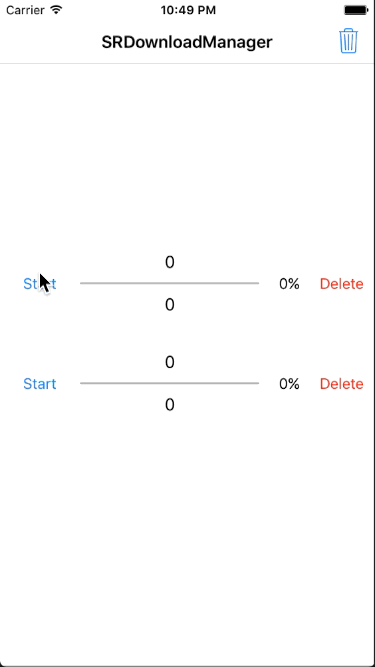

# SRDownloadManager

## Features

* Provides download status callback, download progress callback, download complete callback.
* Support multi-task at the same time to download.
* Support breakpoint download even exit the App.
* Support to delete the specified file by URL and clear all files that have been downloaded.

***

* 提供下载状态回调, 下载进度回调, 下载完成回调.
* 支持多任务同时下载.
* 支持断点下载, 即使退出重启 App.
* 支持通过 URL 删除指定文件和清除所有已下载的文件.

## Show



## Installation

> Drag the **SRDownloadManager** folder to the project.

## Usage

````objc
[[SRDownloadManager sharedManager] download:fileURL state:^(SRDownloadState state) {
    // Called when download state changed.
} progress:^(NSInteger receivedSize, NSInteger expectedSize, CGFloat progress) {
    // Called when download receive data every time.
} completion:^(BOOL isSuccess, NSString *filePath, NSError *error) {
    // Called when download finished with success or error.
}];
````

## API

````objc
+ (instancetype)sharedManager;

- (void)download:(NSURL *)URL
           state:(void(^)(SRDownloadState state))state
        progress:(void(^)(NSInteger receivedSize, NSInteger expectedSize, CGFloat progress))progress
      completion:(void(^)(BOOL isSuccess, NSString *filePath, NSError *error))completion;

- (BOOL)isCompleted:(NSURL *)URL;

- (NSString *)fileFullPath:(NSURL *)URL;

- (CGFloat)fileProgress:(NSURL *)URL;

- (void)deleteFile:(NSURL *)URL;

- (void)deleteAllFiles;
````

**If you have any question, submit an issue or contact me.**   
**If this repo helps you, please give it a star.**  
**Have Fun.**