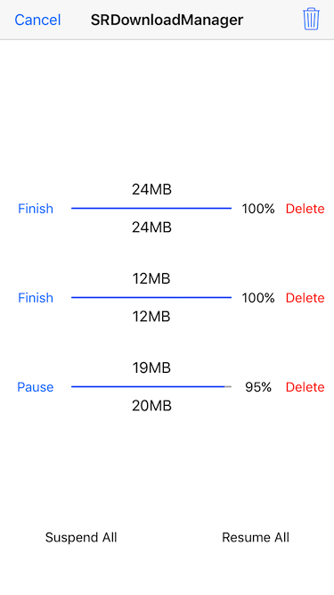

# SRDownloadManager

Powerful and easy-to-use file download manager based on NSURLSession. Provide download status, progress and completion callback block.



## Features

* [x] Support breakpoint download even exit the App and multitasking download at the same time.
* [x] Support to customize the directory to save files or specify the path to save file.
* [x] Support to set maximum concurrent downloads and waiting for download queue mode.
* [x] Support to delete file by URL or name and clear all files that have been downloaded.

## Installation

**CocoaPods**
> Add **pod 'SRDownloadManager'** to the Podfile, then run **pod install** in the terminal.

**Manual**
> Drag the **SRDownloadManager** folder to the project.

## APIs

````objc
+ (instancetype)sharedManager;

/**
 Starts a file download action with URL, download state, download progress and download completion block.
 
 @param URL        The URL of the file which to be downloaded.
 @param destPath   The path to save the file after the download is completed, if pass nil file will be saved in default path.
 @param state      A block object to be executed when the download state changed.
 @param progress   A block object to be executed when the download progress changed.
 @param completion A block object to be executed when the download completion.
 */
- (void)downloadURL:(NSURL *)URL
           destPath:(NSString *)destPath
              state:(void (^)(SRDownloadState state))state
           progress:(void (^)(NSInteger receivedSize, NSInteger expectedSize, CGFloat progress))progress
         completion:(void (^)(BOOL success, NSString *filePath, NSError *error))completion;
````

## Usage

````objc
[[SRDownloadManager sharedManager] downloadURL:URL destPath:nil state:^(SRDownloadState state) {
    // Called when the download state changed.
} progress:^(NSInteger receivedSize, NSInteger expectedSize, CGFloat progress) {
    // Called when the download progress changed.
} completion:^(BOOL success, NSString *filePath, NSError *error) {
    // Called when the download completion.
}];
````

## Custom

````objc
/**
 The directory where the downloaded files are saved, default is .../Library/Caches/SRDownloadManager if not setted.
 */
@property (nonatomic, copy) NSString *saveFilesDirectory;

/**
 The count of max concurrent downloads, default is -1 which means no limit.
 */
@property (nonatomic, assign) NSInteger maxConcurrentCount;

/**
 The mode of waiting for download queue, default is FIFO.
 */
@property (nonatomic, assign) SRWaitingQueueMode waitingQueueMode;
````

## Contacts

Submit an issue or email me if you have any questions. <guowilling90@gmail.com>