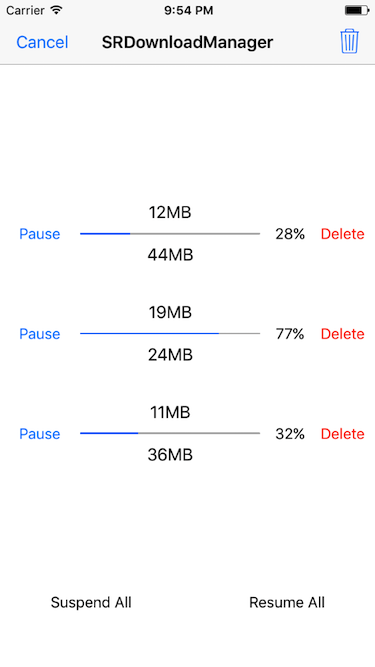
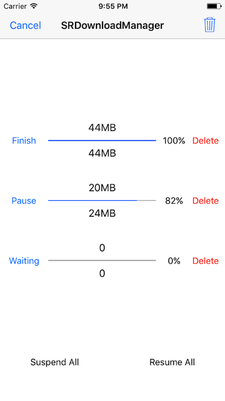

# SRDownloadManager

## Features

* Provide download status callback, download progress callback, download complete callback.
* Support multi-task at the same time to download.
* Support breakpoint download even exit the App.
* Support to delete the specified file by URL and clear all files that have been downloaded.
* Support customize the directory where the downloaded files are saved.
* Support set maximum concurrent downloads and waiting downloads queue mode.

***

* 提供下载状态回调, 下载进度回调, 下载完成回调.
* 支持多任务同时下载.
* 支持断点下载, 即使退出重启 App.
* 支持通过 URL 删除指定文件和清除所有已下载的文件.
* 支持自定义保存下载文件的目录.
* 支持设置最大的并发下载数和等待下载队列的模式.

## Show

 

## Installation

### CocoaPods
> Add **pod 'SRDownloadManager'** to the Podfile, then run **pod install** in the terminal.

### Manual
> Drag the **SRDownloadManager** folder to the project.

## Usage

````objc
[[SRDownloadManager sharedManager] downloadFile:fileURL state:^(SRDownloadState state) {
    // Called when download state changed.
} progress:^(NSInteger receivedSize, NSInteger expectedSize, CGFloat progress) {
    // Called when download receive data every time.
} completion:^(BOOL isSuccess, NSString *filePath, NSError *error) {
    // Called when download finished with success or error.
}];
````

## APIs

````objc
+ (instancetype)sharedManager;

- (void)downloadFileOfURL:(NSURL *)URL
                    state:(void (^)(SRDownloadState state))state
                 progress:(void (^)(NSInteger receivedSize, NSInteger expectedSize, CGFloat progress))progress
               completion:(void (^)(BOOL success, NSString *filePath, NSError *error))completion;

- (BOOL)isDownloadCompletedOfURL:(NSURL *)URL;

- (NSString *)fileFullPathOfURL:(NSURL *)URL;

- (CGFloat)fileHasDownloadedProgressOfURL:(NSURL *)URL;

- (void)deleteFileOfURL:(NSURL *)URL;
- (void)deleteAllFiles;

- (void)suspendDownloadOfURL:(NSURL *)URL;
- (void)suspendAllDownloads;

- (void)resumeDownloadOfURL:(NSURL *)URL;
- (void)resumeAllDownloads;

- (void)cancelDownloadOfURL:(NSURL *)URL;
- (void)cancelAllDownloads;
````

## Custom

````objc
/**
 Directory where the downloaded files are saved, default is .../Library/Caches/SRDownloadManager if not setted.
 */
@property (nonatomic, copy) NSString *downloadedFilesDirectory;

/**
 Count of max concurrent downloads, default is -1 which means no limit.
 */
@property (nonatomic, assign) NSInteger maxConcurrentDownloadCount;

/**
 Mode of waiting downloads queue, default is FIFO.
 */
@property (nonatomic, assign) SRWaitingQueueMode waitingQueueMode;
````

> **If you have any question, submit an issue or contact me.**   
> **QQ: 1990991510**   
> **Email: guowilling@qq.com**   
> **If this repo helps you, please give it a star.**   
> **Have Fun.**